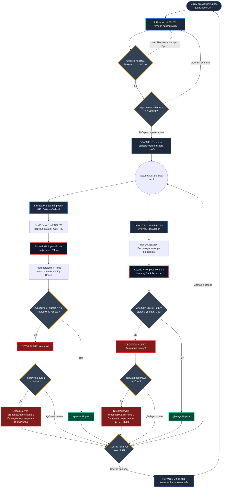

<div align="center">

# 🚄 hsm-barrier
### High-Speed Rail Edge-AI Inspection Barrier System

**Автоматизированный программно-аппаратный рубеж предэксплуатационного постового контроля высокоскоростного подвижного состава (ВСМ)**

[](https://en.cppreference.com/w/cpp/20)
[-orange.svg)](http://www.orangepi.org/)
[](https://www.hiascend.com/)
[](https://opencv.org/)
[](LICENSE)

[Обзор](#-обзор-проекта) • [Архитектура](#-архитектура-и-пайплайн) • [Спецификации](#-технические-характеристики) • [Сборка](#-сборка-и-запуск) • [Аппаратный-комплекс](#-аппаратный-комплекс)

</div>

---

## 📌 Обзор проекта

**hsm-barrier** — аппаратно-программный комплекс превентивного постового досмотра поездов высокоскоростных магистралей (ВСМ).

Комплекс предназначен для развертывания на рубежах входного контроля (горловины станций, депо и пункты технического обслуживания, скоростной режим 30–60 км/ч) за 250-500 метров до скоростных перегонов.

### Решаемые задачи ВСМ:
* **Исключение человеческого фактора:** автоматический мультимодальный досмотр состава вместо длительного ручного обхода.
* **Минимизация простоев и «окон»:** экспресс-анализ состава в движении с временем инференса единицы миллисекунд.
* **Превентивная безопасность на скоростях 300–400 км/ч:** предотвращение срыва токоприемников, обрыва контактной сети 25 кВ и схода вагонов из-за незакрепленного подвагонного оборудования или посторонних объектов.

### Функциональные возможности:
1. **Верхний контур (опора / мачта):** Детекция несанкционированного присутствия людей (зацеперов) и посторонних объектов на крыше и суфле состава (`yolov8n.om`).
2. **Нижний контур (межшпальный короб):** Одноклассовый структурный анализ геометрии днища и поиск дефектов/закладок (`patchcore.om` / `cv::absdiff`).
3. **Аппаратный ToF-гейтинг:** Оптический затвор и нейросетевой пайплайн активируются сервоприводом строго при фиксации габарита клиренса лазерным дальномером VL53L0X[cite: 2, 4].
4. **Zero-Cloud Architecture:** Локальные вычисления на встроенном NPU Ascend 310B без выгрузки сырого видео в сеть.

---

## 🏗 Архитектура и пайплайн

---

## ⚡ Технические характеристики

| Параметр | Значение | Описание |
| :--- | :--- | :--- |
| **Вычислительная платформа** | Orange Pi AI Pro | SoC Huawei Ascend 310B4 (8/20 TOPS) |
| **Время цикла (Latency)** | **24–32 мс** | Обработка видеопотока $\ge 35$ FPS (для версии в 8 TOPS) |
| **Нейросеть верхнего яруса** | YOLOv8n (FP16/INT8) | Выявление силуэтов людей и посторонних предметов |
| **Нейросеть нижнего яруса** | PatchCore / One-Class | Поиск аномалий днища относительно эталона |
| **Аппаратный триггер** | VL53L0X (ToF-лазер) | 940 нм, опрос 33 Гц по I2C, фильтрация по клиренсу |
| **Конструкционные материалы** | Термостойкий ASA | Диапазон от -40°C до +85°C, УФ- и химостойкость |
| **Каналы оповещения** | POSIX Serial, GPIO, JSON | Интеграция с рабочим местом ДСП станции |

---

## 📁 Структура репозитория

```text
hsm-barrier/
├── CMakeLists.txt              # Конфигурация сборки CMake (C++20, CANN, OpenCV)
├── LICENSE                     # Лицензия проекта
├── README.md                   # Документация проекта
├── include/                    # Заголовочные файлы C++
│   ├── hardware/               # Низкоуровневые интерфейсы (I2C, PCA9685, Servo, VL53L0X)
│   │   ├── camera_stream.h
│   │   ├── i2c_bus.h
│   │   ├── pca9685.h
│   │   ├── servo.h
│   │   └── vl53l0x.h
│   └── npu/                    # Движок инференса AscendCL и постпроцессинг
│       ├── npu_model.h
│       └── yolo_postprocess.h
├── src/                        # Исходный код C++
│   ├── hardware/
│   ├── npu/
│   └── main.cpp                # Точка входа в систему постового контроля
├── models/                     # Каталог моделей
│   ├── .gitkeep
│   ├── yolov8n.om              # Скомпилированная модель детекции под NPU
│   └── patchcore.om            # Скомпилированная модель аномалий под NPU
├── scripts/                    # Скрипты автоматизации и MLOps
│   ├── build_arm64.sh          # Скрипт нативной сборки Release на плате
│   └── ML/                     # Экспорт и компиляция нейросетей
│       ├── requirements.txt
│       ├── export_yolo.py
│       ├── train_patchcore.py
│       └── convert_to_om.sh    # Вызов компилятора ATC под Ascend310B4
├── docs/                    # 
│   ├── convert_instructions.md # Инструкция по вызову компилятора ATC
 
```
---
### 🛠 Сборка и запуск
Системные требования:
* ОС: Ubuntu 22.04 LTS (aarch64) / openEuler
* Компилятор: GCC/G++ 11+ (стандарт C++20)
* SDK: Huawei CANN Toolkit 8.0.0+ (/usr/local/Ascend/ascend-toolkit)
* Библиотеки: OpenCV 4.5+ (libopencv-dev)

1. Подготовка окружения

```bash
source /usr/local/Ascend/ascend-toolkit/set_env.sh
export TE_PARALLEL_COMPILER=1
```

2. Компиляция моделей под NPU Ascend (ATC)

Если бинарные файлы .om еще не собраны:
```bash
chmod +x scripts/ML/convert_to_om.sh
./scripts/ML/convert_to_om.sh
```

3. Сборка бинарника barrier

Для автоматической нативной сборки с флагами оптимизации -O3:
```bash
chmod +x scripts/build_arm64.sh
./scripts/build_arm64.sh
```

Либо классическая сборка через CMake:

```bash
mkdir -p build && cd build
cmake -DCMAKE_BUILD_TYPE=Release ..
make -j$(nproc)
```

4. Запуск комплекса
```bash
# Запуск исполняемого файла с доступом к /dev/i2c-7 и видеоустройствам
./build/barrier
```

### ⚙️ Аппаратный комплекс

* Оптико-электронный модуль: Две камеры видимого диапазона (верхняя обзорная на столбце/опоре + нижняя инспекционная в межшпальном ящике)[cite: 2, 3].
* Механическая защита (Clean-Lense): Подвижная шторка на сервоприводе с ШИМ-контроллером PCA9685, предохраняющая нижний объектив от щебня, мазута и снега в межпоездных интервалах.
* Материалы исполнения: Все несущие кронштейны и защитные кожухи изготовлены методом 3D-печати из полимера ASA (сохранение прочности при температурах от -40°C до +85°C, невосприимчивость к железнодорожным ГСМ и ультрафиолету)[cite: 2, 3].
* Инфраструктурная интеграция: Верхний модуль фиксируется на стандартные опоры контактной сети с использованием штатного станционного освещения (Zero-Footprint монтаж)[cite: 3].
